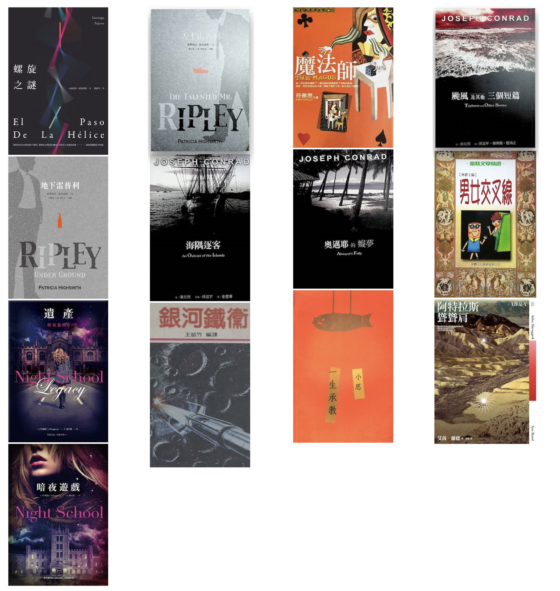
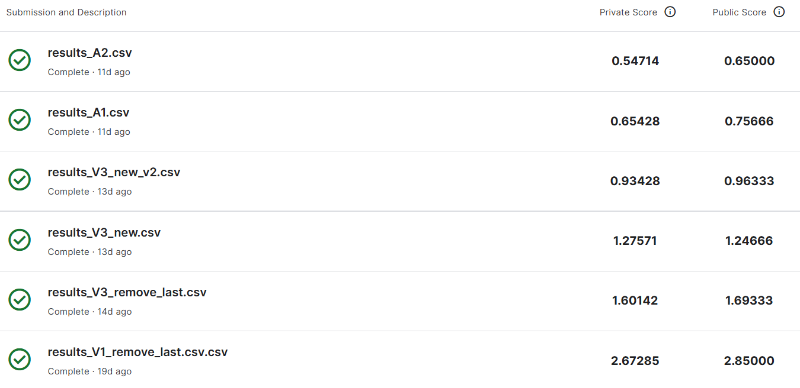
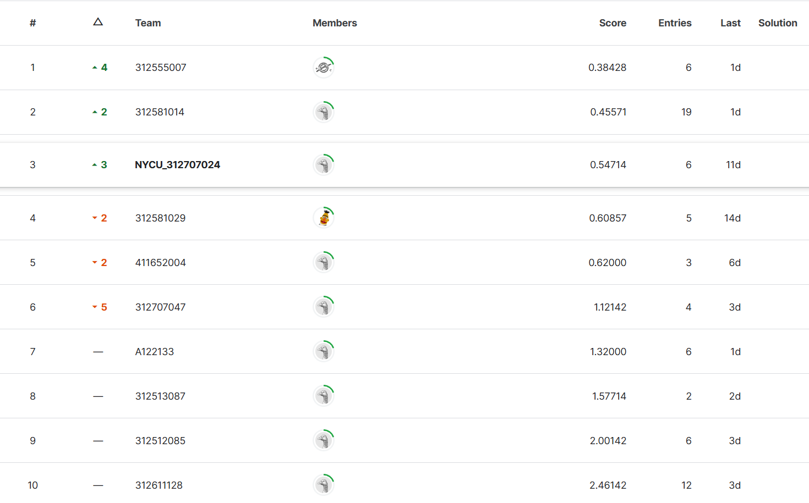

# Kaggle inClass Competition – ZH-TW TV Show Caption Recognition using LMMs

### 目錄
- [Kaggle inClass Competition – ZH-TW TV Show Caption Recognition using LMMs](#kaggle-inclass-competition--zh-tw-tv-show-caption-recognition-using-lmms)
    - [目錄](#目錄)
  - [專案簡介](#專案簡介)
    - [任務目標](#任務目標)
    - [評分標準](#評分標準)
  - [環境設置 (Environment Setup)](#環境設置-environment-setup)
  - [訓練資料準備 (Data Preparation)](#訓練資料準備-data-preparation)
    - [概述](#概述)
    - [圖片資料集](#圖片資料集)
    - [文章資料集](#文章資料集)
    - [合成圖片與文字](#合成圖片與文字)
      - [synth.py使用說明](#synthpy使用說明)
      - [synth\_line\_by\_line.py使用說明](#synth_line_by_linepy使用說明)
      - [設定檔案結構](#設定檔案結構)
      - [執行範例](#執行範例)
    - [產生訓練數據集](#產生訓練數據集)
      - [turn\_to\_train\_format.py使用說明](#turn_to_train_formatpy使用說明)
      - [功能](#功能)
      - [設定參數](#設定參數)
      - [說明](#說明)
  - [模型訓練 (Fine-tuning)](#模型訓練-fine-tuning)
    - [功能特色](#功能特色)
    - [使用範例](#使用範例)
      - [設定參數](#設定參數-1)
      - [說明](#說明-1)
  - [模型推論 (Inference)](#模型推論-inference)
    - [功能特色](#功能特色-1)
    - [使用範例](#使用範例-1)
      - [說明](#說明-2)
  - [模型評估 (Model Evaluation)](#模型評估-model-evaluation)
    - [Result](#result)
    - [Rank](#rank)
  - [心得與結論 (Conclusion)](#心得與結論-conclusion)
    - [心得](#心得)
    - [結論](#結論)

## 專案簡介
本專案參與了 Kaggle 的一項競賽，旨在使用大規模語言模型 (LMMs) 進行繁體中文電視節目字幕識別。該競賽的目的是為了提高字幕識別的精度，並且探索 LMMs 在實際應用中的潛力。與傳統的光學字符識別 (OCR) 方法不同，本專案聚焦於使用語言模型進行字幕識別，這種方法可以在一定程度上克服傳統方法的局限性。

### 任務目標
1. **LMM 微調 (Finetuning) 字幕識別**：通過對大規模語言模型進行微調，來自動抓取視頻中的繁體中文字幕。
2. **避免使用傳統 OCR 方法**：傳統 OCR 方法在處理不同字體、背景和噪音時可能會遇到困難，而本專案將探索 LMMs 在這些情況下的優勢。

### 評分標準
評分標準基於字符錯誤率 (Character Error Rate, CER)，CER 的計算方式如下：
- **公式**：CER = (D + S + I) / N × 100%
  - **N**：總詞數
  - **D**：刪除錯誤
  - **S**：替換錯誤
  - **I**：插入錯誤
- **使用 Levenshtein Mean 計算**：實際上在 Kaggle 比賽中使用 Levenshtein Mean 進行計算，以確保評估的準確性和公平性。

## 環境設置 (Environment Setup)

為了確保我們的環境要求能滿足TinyLLaVA_Factory需求，請按照以下步驟從頭創建環境。該說明引導與TinyLLaVA_Factory官方文檔一致。

1. **Clone Repository並進入資料夾**
    ```bash
    git clone https://github.com/TinyLLaVA/TinyLLaVA_Factory.git
    cd TinyLLaVA_Factory
    ```

2. **創建並激活 Conda 環境，安裝必要的套件**
    ```Shell
    conda create -n tinyllava_factory python=3.10 -y
    conda activate tinyllava_factory
    pip install --upgrade pip  # 啟用 PEP 660 支持
    pip install -e .
    ```

3. **安裝附加套件**
    ```Shell
    pip install flash-attn --no-build-isolation
    ```

4. **升級到最新代碼**
    ```Shell
    git pull
    pip install -e .
    ```

* **記住**:
  確保 CUDA 版本至少為 11.6 或更高版本，不然flash-attn將無法正常安裝。

## 訓練資料準備 (Data Preparation)

### 概述
為了有效地訓練模型，我們必須準備合適的訓練數據集。由於本次作業未提供預設的訓練數據集，您需要自行準備。在這次作業中，我們從網路上下載了多張圖片和多篇文章，並將其轉換為訓練數據集。

### 圖片資料集

我們從 Kaggle 下載了 Mini-ImageNet 數據集，這是一個包含3923張圖片的小型圖片數據集。我們將這些圖片用作背景圖片來生成訓練數據集。

1. **下載地址**：[Mini-ImageNet](https://www.kaggle.com/datasets/deeptrial/miniimagenet)
2. **解壓縮文件**：將下載的 zip 文件解壓縮到 `imagenet` 資料夾下。
3. **圖片整理**：
   - 使用 `imagenet/copy_to_only_image.sh` 將每個類別的圖片移動到 `imagenet` 資料夾下的 `only_images` 資料夾中：
   ```bash
   bash copy_to_only_image.sh imagenet/ImageNet-Mini imagenet/only_images
   ```

### 文章資料集

1. **取得文章資料**：
   - 從[好讀網站](https://www.haodoo.net/)下載多篇文章，轉換為訓練數據集。本次作業下載了100本電子書，並將其轉換為 `.txt` 檔存放到 `online_txt/org` 資料夾中(以其中13本作為範例)。
   

2. **處理文字**：

   - **分割文字**：
     - 使用 `online_txt/split_subtitles.sh` 將文字分割為適當的長度。該腳本的使用方式如下：
       - `-i`：包含 `.txt` 文件的輸入目錄。
       - `-o`：輸出字幕文件的目錄。
       - `-m`：每行的最大字符數（可選，默認為15）。
       - 命令如下：
       ```bash
       bash split_subtitles.sh -i online_txt/org -o online_txt/subtitles -m 15
       ```

   - **清理文字**：
     - 使用 `online_txt/clean_subtitles.sh` 刪除每行前面的空格以及字數小於5的行。該腳本的使用方式如下：
       - `-i`：包含要處理的 `.txt` 文件的輸入目錄。
       - `-o`：保存處理後文件的輸出目錄。
       - `-m`：保留行的最小字符數（可選，默認為5）。
       - 命令如下：
       ```bash
         bash clean_subtitles.sh -i online_txt/subtitles -o online_txt/clean_subtitles -m 5
       ```

   - **合併文字**：
     - 使用 `online_txt/concat_all_txt.sh` 將所有字幕合併成一個大的字幕檔 `.txt`。該腳本的使用方式如下：
       - 命令如下：
       ```bash
         bash concat_all_txt.sh online_txt/clean_subtitles online_txt/all_txt.txt
       ```
### 合成圖片與文字

本文介紹兩個生成合成圖像數據的程式，分別是synth.py和synth_line_by_line.py。這些程式將給定的文字放置於隨機選取的圖像上，並進行相關處理。以下為如何使用這兩個程式的詳細說明。

#### synth.py使用說明
`synth.py`程式用於生成大量的合成圖像，將文字檔案中的句子隨機放置於背景圖像上，並進行適當的圖像處理，如調整圖像大小和文字顏色等。

- `output_directory`：這是指定生成的圖像將被儲存的位置。如果這個目錄不存在，程式會自動建立。

- `number_of_images`：這個參數指定了要生成的圖像數量。在這個範例中，程式將會生成 5,000,000 張圖像。你可以根據需求調整這個數量。

- `text_file_path`：這是包含要添加到圖像上的文字的檔案路徑這個檔案應該是每行包含一個句子的純文字檔案。

- `image_directory`：這是包含背景圖像的目錄。。程式會從這個目錄中隨機選取圖像來生成合成圖像。


#### synth_line_by_line.py使用說明
`synth_line_by_line.py`程式用於逐行處理文字檔案中的每個句子，生成合成圖像。每個句子對應生成一張圖像。
`synth.py`程式用於生成大量的合成圖像，將文字檔案中的句子隨機放置於背景圖像上，並進行適當的圖像處理，如調整圖像大小和文字顏色等。

- `output_directory`：這是指定生成的圖像將被儲存的位置。如果這個目錄不存在，程式會自動建立。

- `text_file_path`：這是包含要添加到圖像上的文字的檔案路徑。這個檔案應該是每行包含一個句子的純文字檔案。

- `image_directory`：這是包含背景圖像的目錄。程式會從這個目錄中隨機選取圖像來生成合成圖像。


#### 設定檔案結構

確保檔案結構和上述參數相匹配：

```bash
/mnt/sda1/htchang/DL/HW3/
│
├── train_data/
│   ├── images/                # 輸出圖像的目錄
│   └── out.txt                # 程式生成的輸出文件
│   └── mistake.txt            # 錯誤紀錄文件
│
├── online_txt/
│   └── all_txt.txt            # 包含句子的文字檔案
│
└── imagenet/
    └── only_image/            # 背景圖像目錄
```

#### 執行範例

確認以上目錄和檔案結構無誤後，執行程式：

```bash
python synth.py
```
or
```bash
python synth_line_by_line.py
```

程式將會從指定的文字檔案和圖像目錄中讀取內容，生成合成圖像並儲存到指定的輸出目錄中。生成過程中的進度將會顯示在終端上。

### 產生訓練數據集
#### turn_to_train_format.py使用說明

此程式用於將指定格式的文字文件轉換為JSON格式的訓練數據。它會讀取文字文件中的圖像路徑和對應的文字說明，並按照特定格式生成訓練數據文件。
  
  ```python
  item = {
    "id": hashed_id,
    "image": full_path,
    "conversations": [
        {
            "from": "human",
            "value": "<image>\n請幫我截取出圖片中下方的語音字幕"
        },
        {
            "from": "gpt",
            "value": caption
        }
    ]
}
  ```

#### 功能

1. 讀取指定的文字文件，解析每行的圖像路徑和文字說明。
2. 對圖像路徑進行哈希處理，生成唯一的ID。
3. 生成包含圖像路徑和對應文字說明的JSON格式訓練數據。
4. 將生成的訓練數據保存到指定的輸出目錄。

#### 設定參數

- `file_path`：指定輸入的文字文件路徑，文件每行包含一個圖像文件名和對應的文字說明。
- `output_dir`：指定輸出JSON文件的儲存目錄。


#### 說明

1. 程式會讀取`file_path`指定的文字文件，文件中每行應包含一個圖像文件名和對應的文字說明，以空格分隔。
2. 程式會對每個圖像路徑進行SHA-256哈希，生成唯一的ID。
3. 將每個圖像路徑和對應的文字說明轉換為特定格式的JSON對象。
4. 將所有JSON對象保存到`output_dir`指定的輸出目錄中的`train_output.json`文件。


## 模型訓練 (Fine-tuning)

TinyLLaVA Factory 是一個用於小規模大型多模態模型 (LMM) 的開源模塊化代碼庫，主要實現於 PyTorch 和 HuggingFace。此代碼庫的目標是簡化代碼實現、增加新功能的可擴展性和訓練結果的可重現性。

### 功能特色

- **簡化代碼實現**：TinyLLaVA Factory 提供了一套簡單易用的接口，允許用戶自定義多模態模型，減少編碼錯誤。
- **模塊化設計**：支持多種前沿模型和方法，包括多種語言模型 (LLM)、視覺塔 (Vision Tower) 和連接器 (Connector)。
- **靈活的訓練配方**：支持凍結/全量/部分調整和 LoRA/QLoRA 調整。

### 使用範例

以下是使用 TinyLLaVA_Factory 進行模型微調 (Fine-tuning) 的範例腳本。此範例展示了如何準備數據並啟動模型訓練過程。

#### 設定參數

```bash
# 資料和圖像路徑
DATA_PATH="/mnt/sda1/htchang/DL/HW3/online_ans/train_output.json"
IMAGE_PATH="/mnt/sda1/htchang/DL/HW3/online_ans/out_images"

# 模型參數
MODEL_MAX_LENGTH=100
OUTPUT_DIR="/mnt/sda1/htchang/DL/HW3/checkpoints/custom-finetune-TinyLLaVA-Phi-2-SigLIP-3.1B-lora_a1"
PRETRAINED_MODEL="tinyllava/TinyLLaVA-Phi-2-SigLIP-3.1B"

# 執行微調訓練腳本
deepspeed /mnt/sda1/htchang/DL/HW3/TinyLLaVA_Factory/tinyllava/train/custom_finetune.py \
    --deepspeed /mnt/sda1/htchang/DL/HW3/TinyLLaVA_Factory/scripts/zero2.json \
    --data_path  $DATA_PATH \
    --image_folder $IMAGE_PATH \
    --is_multimodal True \
    --conv_version phi \
    --mm_vision_select_layer -2 \
    --image_aspect_ratio square \
    --fp16 True \
    --training_recipe lora \
    --tune_type_llm lora \
    --tune_type_vision_tower frozen \
    --tune_vision_tower_from_layer 0 \
    --tune_type_connector full \
    --lora_r 128 \
    --lora_alpha 256 \
    --group_by_modality_length False \
    --pretrained_model_path $PRETRAINED_MODEL \
    --output_dir $OUTPUT_DIR \
    --num_train_epochs 3 \
    --per_device_train_batch_size 4 \
    --per_device_eval_batch_size 4 \
    --gradient_accumulation_steps 8 \
    --evaluation_strategy "no" \
    --save_strategy "steps" \
    --save_steps 10000 \
    --save_total_limit 1 \
    --learning_rate 1e-4 \
    --weight_decay 0. \
    --warmup_ratio 0.03 \
    --lr_scheduler_type "cosine" \
    --logging_steps 1 \
    --tf32 False \
    --model_max_length $MODEL_MAX_LENGTH \
    --gradient_checkpointing True \
    --dataloader_num_workers 8 \
    --lazy_preprocess True \
    --report_to tensorboard \
    --tokenizer_use_fast False \
    --run_name custom-finetune-TinyLLaVA-Phi-2-SigLIP-3.1B-lora_a1
```

#### 說明

1. **資料路徑與圖像路徑**：
    - `DATA_PATH`：指定訓練數據的 JSON 文件路徑。
    - `IMAGE_PATH`：指定包含圖像的目錄。

2. **模型參數**：
    - `MODEL_MAX_LENGTH`：設置模型的最大長度。
    - `OUTPUT_DIR`：指定訓練後模型的輸出目錄。
    - `PRETRAINED_MODEL`：使用預訓練模型的名稱。

以上範例展示了如何配置並執行 TinyLLaVA_Factory 進行自定義數據集上的模型微調。根據自己的需求修改相關參數，即可開始模型訓練。
個人體感num_train_epochs 設為3~5即可，設太大會導致訓練時間過長，且可能會過擬合。

## 模型推論 (Inference)

此說明介紹如何使用 `inference.py` 進行模型推理。本程式特別優化了每次推理時不必重新加載模型的問題，從而減少產生結果的時間。

### 功能特色

- **一次加載模型**：模型和處理器僅在開始時加載一次，避免每次推理都重新加載模型，顯著提高推理效率。
- **圖像和文本處理**：支持圖像和文本的預處理，並使用模型生成對應的文本結果。
- **批量處理**：可以處理目錄中的所有圖像，並將結果保存為 CSV 文件。

### 使用範例

以下是 `inference/inference.py` 的範例腳本。此範例展示了如何進行推理，並生成結果。

#### 說明

1. **模型和資料路徑**：
    - `model_path`：指定預訓練模型的路徑。
    - `prompt`：設置輸入提示，用於生成文本的起始提示。
    - `image_dir`：指定包含圖像的目錄。
    - `conv_mode`：選擇模型的對話模式（例如 `phi`）。

2. **一次加載模型和預處理器**：
    - 使用 `load_pretrained_model` 函數加載模型、標記器、圖像處理器和上下文長度。
    - 初始化文本和圖像預處理器，並將模型移至 CUDA 設備。

3. **處理圖像和生成文本**：
    - 遍歷目錄中的所有圖像文件，依次進行處理。
    - 為每個圖像生成輸入文本，並進行相應的預處理。
    - 使用 `model.generate` 方法生成圖像對應的文本輸出。

4. **結果保存**：
    - 將結果保存到 `results` 列表中，每個結果包含圖像文件名和生成的文本。
    - 最後，將結果轉換為 Pandas DataFrame 並保存為 CSV 文件。

這樣的設計可以顯著減少每次推理時的時間消耗，因為模型和處理器僅在開始時加載一次，而不是每次推理都重新加載。這對於處理大量圖像的應用場景特別有效。

## 模型評估 (Model Evaluation)
### Result

### Rank


## 心得與結論 (Conclusion)

### 心得

在這次參與 Kaggle inClass 的繁體中文電視節目字幕識別競賽中，我們使用大規模語言模型 (LMMs) 進行了字幕識別的嘗試，並且取得了顯著的成果。整個專案從環境設置、訓練資料準備、模型訓練到最終的模型推論，皆展示了語言模型在此應用中的潛力和優勢。以下是我在這次專案中的一些心得：

1. **LMMs 的強大潛力**：與傳統的光學字符識別 (OCR) 方法相比，LMMs 在處理不同字體、背景和噪音的情況下表現出色，能夠更準確地識別字幕內容。這證明了語言模型在字幕識別領域的巨大潛力。

2. **數據準備的重要性**：在本次專案中，準備合適的訓練數據是至關重要的。我們使用合成圖片與文字的方法，生成了大量的訓練數據，這些數據為模型的訓練提供了堅實的基礎。同時，數據清理和處理的過程也極為關鍵，確保了訓練數據的質量。

3. **環境設置與工具使用**：從環境設置到使用 TinyLLaVA_Factory 進行模型微調和推論，我們遵循了官方文檔的指引，並且針對我們的應用場景進行了適當的調整。這不僅提高了工作效率，還確保了結果的準確性和可重現性。

4. **模型微調與評估**：在模型微調過程中，我們嘗試了不同的參數設置，以尋找最佳的模型配置。最終，我們的模型在字符錯誤率 (CER) 評估標準下取得了不錯的成績，證明了我們的方法和流程的有效性。

5. **提早開始的優勢**：這次專案我們較早開始進行，給了我們更多的時間進行訓練和調整模型參數。充分利用這段時間，我們得以嘗試更多的配置和數據增強方法，最終達到更好的結果。

### 結論

總結來說，本次 Kaggle競賽展示了使用大規模語言模型進行繁體中文電視節目字幕識別的可行性和優勢。我們通過一系列的步驟，包括環境設置、數據準備、模型訓練和推論，成功地構建了一個有效的字幕識別系統。這次專案不僅讓我對語言模型在實際應用中的潛力有了更深的認識，也增強了我在處理實際問題時的技能和信心。

**特別值得一提的是，我們在最後大幅增加了訓練數據集的規模以及訓練時間，這使得我們的模型表現得到了始料未及顯著提升**，最終在競賽中取得了第三名的好成績。從成績來看，我們的模型在公開分數和私人分數上都達到了較高的準確率，分別為 0.54714 和 0.65000，**從來沒想過會那麼好，但也算是體驗到大力出奇蹟的湧現能力**。

這次專案的經驗將成為我在未來工作中的寶貴財富，幫助我在面對新的挑戰時更加從容應對。未來，隨著技術的不斷發展，我們可以期待 LMMs 在字幕識別以及其他類似應用中的更廣泛應用和更優秀的表現。